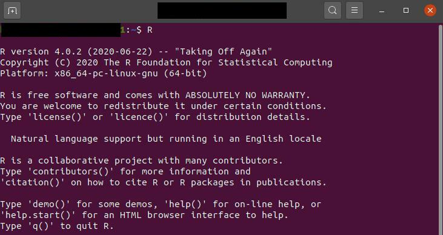

Hello there! In this post, we are going to see how we can install `R` in our Ubuntu 20.04 LTS. Also, we will install two of R's popular packages, namely: [tidyverse](https://www.tidyverse.org/) & [rstan](https://mc-stan.org/users/interfaces/rstan). Both of these packages are important tools for data scientists. Rstan is the R interface for [stan](https://mc-stan.org/), which is the state-of-the-art platform for statistical modeling and high-performance statistical computation. I faced so much difficulty installing these. So, I decided to make it simple for you guys.

### Installing R

First, let's install the `R` in our system. We will install R from [CRAN](https://cran.r-project.org/) repository. We need to install some dependencies for adding a new repository over HTTPS. To do that, we will run the following command in our terminal. 

```console
sudo apt-get install dirmngr gnupg apt-transport-https ca-certificates software-properties-common
```

Then, we need to add the CRAN repository to our system sources’ list. We can do that by typing the following commands into our terminal.

```console
sudo apt-key adv --keyserver keyserver.ubuntu.com --recv-keys E298A3A825C0D65DFD57CBB651716619E084DAB9
sudo add-apt-repository 'deb https://cloud.r-project.org/bin/linux/ubuntu focal-cran40/'
```

Finally, we will install R by using the following command.

```console
sudo apt-get install r-base
```

Now, the R should be installed in our system. To check that, we can run the following command into our terminal.

```console
R
```

If R is installed correctly, the console will show something like this: 



### Installing tidyverse

Now, we will install the tidyverse packages. **Please note that we need to install `tidyverse` first then install `rstan`, because `rstan` requires some dependencies. By installing `tidyverse` first, it will make the job easier.** First of all, we need to install some dependencies by typing the following commands in our terminal.

```console
sudo apt-get install -y libxml2-dev libcurl4-openssl-dev libssl-dev libv8-dev
```

Then install `tidyverse` by using the following commands:

```console
sudo R
install.packages('tidyverse')
```

It will take some time to get installed. After installation, exit from the `r` environment using the `q()` function and be sure to save the environment when prompted.


### Installing rstan

To install the rstan, we need first check if our system has rstan already installed. If it has, then we need to remove it. We can do this by using the following commands:

```console
remove.packages("rstan")
if (file.exists(".RData")) file.remove(".RData")
```

Now, we need to check the c++ toolchain. We can do that by using these commands:

```console
sudo R
pkgbuild::has_build_tools(debug = TRUE)
```
This command will check if the installed c++ is using the pkgbuild package. The system will give the output `TRUE` if it is using the pkgbuild package. Otherwise, we need to follow instructions from [here](https://github.com/stan-dev/rstan/wiki/Installing-RStan-on-Linux).

Now, run the following command to install rstan.

```console
install.packages("rstan", repos = "https://cloud.r-project.org/", dependencies = TRUE)
```
Again, it will take some time to get installed. After the installations, exit from the `r` environment using `q()` function and be sure to save the environment when prompted.

Happy Coding!!!


#### References

1. [Blog post on installing R](https://linuxize.com/post/how-to-install-r-on-ubuntu-20-04/)
2. [Official instruction of installing rstan](https://github.com/stan-dev/rstan/wiki/RStan-Getting-Started)


