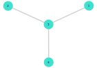

# Graph Basics

Here in this tutorial, we are going to explore graphs using `Julia`. To use graph we need to install `LightGraphs` package and to visualize graphs, we need to install `GraphPlot` package. To install, we need to open the Julia application with administrative rights and type the followings:

```julia

using Pkg
Pkg.add("LightGraphs")
Pkg.add("GraphPlot")

```

Alternatively, we can also install these packages by typing the followings in the application `] add LightGraphs` , and
`] add GraphPlot`. 

Now, after installing it we need to import these packages into our system.

##### _input_
```julia
using LightGraphs
using GraphPlot
using Random
```

Now, we want to create a traingle graph. To do that, we first need to create the graph structure by using `Graph()` method, this method takes **number_of_node** as input, then we need to add edges by using `add_edge!()` method. After creating the graph we can plot it using `gplot()` method.

##### _input_
```julia
g = Graph(4)

add_edge!(g, 1, 2)
add_edge!(g, 1, 3)
add_edge!(g, 1, 4)
add_edge!(g, 2, 4)
add_edge!(g, 3, 4)


gplot(g, nodelabel=[1, 2, 3, 4])
```
##### _output_


#### Graph from Adjacency Matrix


We also can use adjacency matrix to create a graph.

##### _input_
```julia
adj_mat = [
    
    0 1 1 1
    1 0 0 1
    1 0 0 1
    1 1 1 0
    
]

g_adj = Graph(adj_mat)

gplot(g_adj, nodelabel=[1, 2, 3, 4])
```

##### _output_


#### Random Graphs

We can create random graph by passing **number_of_node** and **number_of_edges** to the `Graph()` method. Suppose we want to create a graph with 4 nodes and 3 edges. We can do that by this following codes.

##### _input_
```julia
Random.seed!(2)

rand_graph = Graph(4,3)

gplot(rand_graph, nodelabel = 1:4)
```

##### _output_





#### Graph Properties


Also, we can take a look at how many node and edges in a graph by using `nv()` and `ne()` methods respectively. We can acess the nodes and edges specifically by using `vertices()` and `edges()` iterable methods. Also, in the edge, we can find the source and destination of an edge by using `src()` and `dst()` methods.

##### _input_
```julia
println("Number of Nodes: ", nv(rand_graph))
println("Number of Edges: ", ne(rand_graph))
```
##### _output_
    Number of Nodes: 4
    Number of Edges: 3
    

##### _input_
```julia
println("Accesing nodes: ")

for i in vertices(rand_graph)
    println("node $i")
end

println("")
println("================")
println("")

println("Accesing edges: ")

for j in edges(rand_graph)
    u, v = src(j), dst(j)
    println("edge $u - $v")
end
```
##### _output_
    Accesing nodes: 
    node 1
    node 2
    node 3
    node 4
    
    ================
    
    Accesing edges: 
    edge 1 - 3
    edge 2 - 3
    edge 3 - 4
    

We have already seen that, to add edges we need to use `add_edge!()` method. Now to remove edge we need to use `rem_edge!()` method and need to specify whihc edge we want to delete. Also, we can add nodes to our graph by using `add_vertex!()` method and delete nodes by using `rem_vertex!()` method. `rem_vertex!()` takes a node number as parameter and deletes that specific node from the graph.

Let's use these methods. Suppose we want to delete the edge from node 3 to node 4, then we will add another node and connect that node with node 1 with an edge. In the end we will delete a node.

##### _input_
```julia
#removing edge

rem_edge!(rand_graph, 3, 4)

gplot(rand_graph, nodelabel = vertices(rand_graph))
```


##### _output_


##### _input_

```julia
# adding node

add_vertex!(rand_graph)

gplot(rand_graph, nodelabel = vertices(rand_graph))
```


##### _output_


##### _input_

```julia
# Connecting node 5 with node 1

add_edge!(rand_graph, 5, 1)

gplot(rand_graph, nodelabel = vertices(rand_graph))
```


##### _output_


##### _input_

```julia
# deleting node number 4

rem_vertex!(rand_graph, 4)

gplot(rand_graph, nodelabel = vertices(rand_graph))
```


##### _output_


We can derieve the adjacency matrix from a graph by using `adjacency_matrix()` method. Here we have created a matrix of `rand_graph's` adjacency matrix.

##### _input_
```julia
Matrix(adjacency_matrix(rand_graph))
```


##### _output_

    4×4 Array{Int64,2}:
     0  0  1  1
     0  0  1  0
     1  1  0  0
     1  0  0  0


#### Coloring the Graph

We can change the color of node and edges by using `gplot()` method's `nodefillc` and `edgestrokec` parameter respectively. But to that first we need to import the `Colors` package. We need to assign the color code to them. Suppose we want to color the nodes red and the edges to lightgreen. 

##### _input_
```julia
using Colors
```


```julia
gplot(rand_graph, nodefillc = colorant"red", edgestrokec = colorant"lightgreen", nodelabel = vertices(rand_graph))
```


##### _output_


#### Directed Graph

We can create a Directed graph by using the `DiGraph()` constructor. Here we have pass a adjacency matrix to the constructor.

##### _input_
```julia
dir_adj = [
    
    0 0 0 0 0
    1 0 0 1 0
    1 0 0 1 0
    0 1 0 0 0
    0 0 0 1 0
]

GG = DiGraph(dir_adj)
gplot(GG, nodelabel = vertices(GG))
```


##### _output_


#### Saving graph to png file

We can also save the graph into a png format. But to do that we need to import `Compose` and `Cairo` packages. If you don't have them installed, then follow the procedure of the begining of this notebook. To save the file we need to call the `draw` method and we have given it two parameters such as png file parameter and the graph to save.

##### _input_
```julia
using Compose
using Cairo
```


```julia
draw(PNG("fig/graph1.png", 16cm, 16cm), gplot(GG, nodelabel = vertices(GG)))
```

So, thats it then. 

Keep practicing.

Good Luck, may the julia be with you!!
