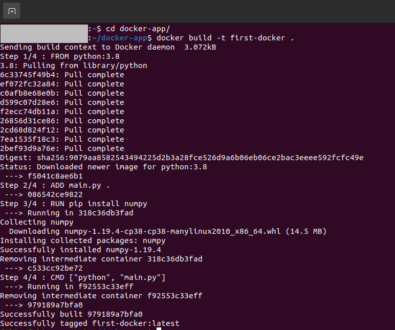

I always get in trouble when creating a new project with different dependencies installed on my machine. I had to reinstall new libraries, which is doing a new thing repeatedly, and it's time-consuming. Then I learned about docker. Docker will allow you to create a virtual machine to install all your dependencies for your specific project without tempering your primary system. Still, it is faster than the virtual machine. In this tutorial, we are going to see: 

1. Installing docker on ubuntu 20.04 LTS
2. Creating and running a python script using docker image

## Installing Docker

For installing docker from the website for the different OS, you can visit [here.](https://docs.docker.com/get-docker/) First of all, we are going to uninstall previously installed docker (if have any). We will run the following command in the terminal to do that:

```console
$ sudo apt-get remove docker docker-engine docker.io containerd runc
```

#### Setting up the Repository

Then we need to update the `apt` packages and install the following dependencies by running the commands:

```console
$ sudo apt-get update
$ sudo apt-get install \
    apt-transport-https \
    ca-certificates \
    curl \
    gnupg-agent \
    software-properties-common
```

Now we need to add the Docker's official GPG key to the system.

```console
$ curl -fsSL https://download.docker.com/linux/ubuntu/gpg | sudo apt-key add -
```
We will use the following command to set up the stable repository.

```console
$ sudo add-apt-repository \
   "deb [arch=amd64] https://download.docker.com/linux/ubuntu \
   $(lsb_release -cs) \
   stable"
```

#### Installing Docker Engine

To install the docker engine first we have to update the `apt` package again and run the following commands:

```console
$ sudo apt-get update
$ sudo apt-get install docker-ce docker-ce-cli containerd.io
```
Now, the docker should be installed in our system, but before we test it, first we need to add the docker into usergroup, otherwise in some system it will give error. We can do this by using the following commands:

```console
$ sudo groupadd docker
$ sudo usermod -a -G docker ${USER}
$ grep docker /etc/group
$ newgrp docker
```

After running this command, **you have to logout or restart the pc**. Then run the following command to test the docker system.

```console
$ sudo docker run hello-world
```
This will download a test container and print some messages and then it will exit.

## Creating First Docker Script

Now, it's time to create our first program that will run on docker. Here we will create a simple script that will measure the square root of a number using the python's `NumPy` library. So, in this program, we have a dependency, and that is NumPy. We have to install the dependency inside our docker container. First, we will create a folder containing all the necessary things such as python file, docker image etc.

Then we will create the python script which we will run, let's name it `main.py` and write the following code into that.

```python
import numpy as np

a = np.sqrt(16)

print(f'The square root of 16 is {a}')
```

Now, let's create a file name `Dockerfile`. This file is the blueprint of the docker image. _"A docker image is a combination of a file system and [parameters](https://searchitoperations.techtarget.com/definition/Docker-image)."_ In other words, this file will contain the information on the working environment, dependencies etc. of our docker app. And the docker container (it's an instance of docker image) will run the docker system. 

Let's put the following lines in the `Dockerfile`.

```docker
FROM python:3.8

ADD main.py .

RUN pip install numpy

CMD ["python", "main.py"]
```

Now, let's understand what these lines represent. The docker needs an environment where the docker will run, and this environment can be an operating system, a software package, a python environment etc. Here we are using Python version 3.8 as our environment. By executing `FROM python:3.8` line, the docker container pulls python version 3.8 from the docker [hub](https://hub.docker.com/). To add the python script in the docker current directory, we will use `ADD main.py .` line. The `.` specifies the current directory. Now, we will be going to install the dependencies, in the python script we have only one dependency, and that is numpy. So to install the NumPy dependency, we are using `RUN pip install numpy`. If your program has other dependencies, you can add them in this line. And finally, to run the python script, we will use `CMD` command. Usually, we run a python script in the terminal by using `python main.py` command. Just like this, we will pass this command into a tokenized list with the `CMD` command. So, `CMD ["python", "main.py"]` will run the python script inside the docker container.

#### Building the Docker Image

We have the `Dockerfile` ready, and we now know what it contains and what the lines inside the `Dockerfile` does, it is time to build the docker image! To build the docker image, we need to give the following command:

```console
$ docker build -t first-docker .
```
Here `first-docker` is our docker image name. We can name it whatever we want. And the `-t` argument is used for tagging the resulting image. After running this command, it will look like the following screenshot.



#### Running the Docker Image

So, our docker image is now ready. To run our image we need to give the following command in the terminal:

```console
$ docker run first-docker
```
This command will run the docker image and give the output of the python script we have written. In our case, we have calculated the square root of 16 using NumPy's sqrt function. So we will see the result like the following screenshot.


Congratulations! We have just run our first docker app. We can do more complex things with docker, keep digging. The code for this tutorial can be found in [here](https://github.com/fahim-sikder/docker-tutorial).

Have fun and Stay Safe!

### Reference
1. [Docker official installation procedure](https://docs.docker.com/engine/install/)
2. [Docker Hub](https://hub.docker.com/)


