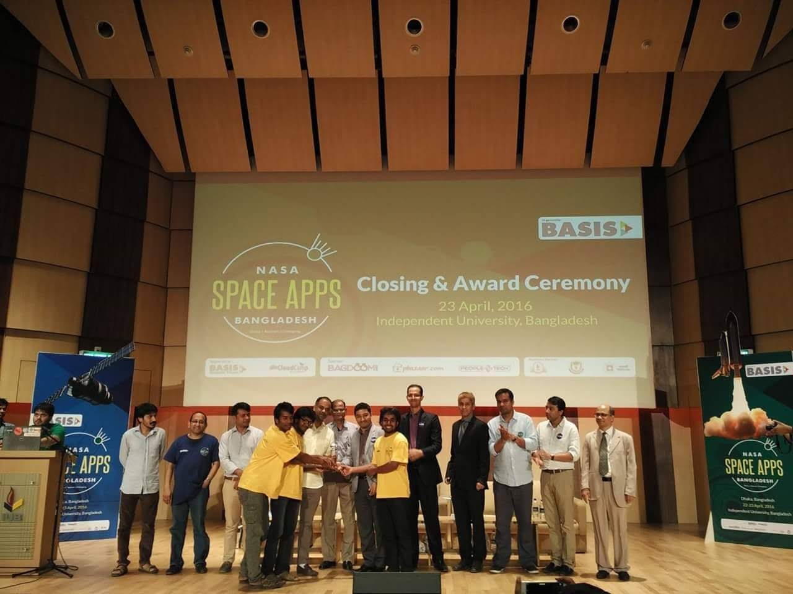
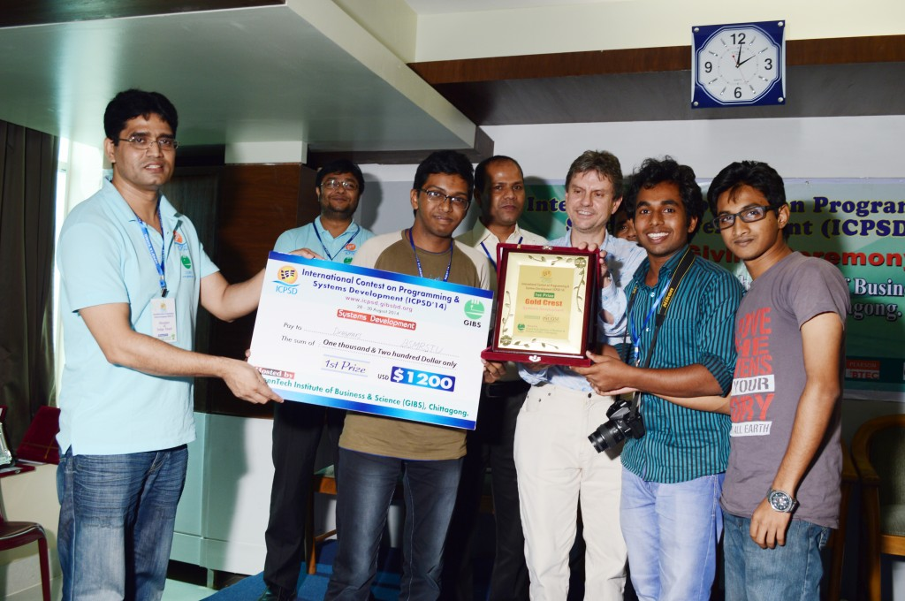

তারিখটা ছিল ১লা জানুয়ারি ২০১৩, বঙ্গবন্ধু শেখ মুজিবুর রহমান বিজ্ঞান ও প্রযুক্তি বিশ্ববিদ্যালয়ের কম্পিউটার সায়েন্স এন্ড ইঞ্জিনিয়ারিং বিভাগের ২য় ব্যাচের একজন শিক্ষার্থী হিসেবে যাত্রা শুরু করি। সেই সময়টার ক্যাম্পাস এখনের মতন এত সবুজ ছিল না। কাচা রাস্তা, ধুলায় পরিপূর্ণ ক্যাম্পাসের মধ্য অল্প কয়েকটি বিল্ডিং দাড়িয়ে ছিল। তখনও প্রশাসনিক ভবনের কাজ শুরু হয়নি। আমাদের (সিএসই) ক্লাস হতো আচার্য জগদীশ চন্দ্র বসু ভবনের (একাডেমিক বিল্ডিং) চতুর্থ তলায়। ক্যাম্পাসের আশে পাশে কোন খাবারের হোটেল ছিল না, ক্যাম্পাসের সীমানার ঠিক বাইরে একটি ছনের ঘরে অস্থায়ী খাবারের হোটেল ছিল।

তৎকালীন সময়ে আমরা সর্বমোট শিক্ষার্থী ছিলাম প্রায় ৫০০ জনের মত। শিক্ষার্থী কম থাকায় প্রায় সকল শিক্ষকই আমাদের চিনতেন। তৎকালীন ছাত্র-শিক্ষক সম্পর্কটা ছিল খুবই অসাধারণ। তাঁরা শুধু একাডেমিক শিক্ষকই ছিলেন না, কিভাবে মানুষ হওয়া যায় ঐ দীক্ষাও দিয়েছিলেন। আমাদের শহিদুল স্যার, দিলীপ কুমার নাথ স্যার, খাইরুল আলম স্যার, হানিফ স্যারের মত শিক্ষক ছিলেন। আমরা শিক্ষার্থী কম হওয়ায় মোটামুটি সবাই সবাইকে চিনতাম। আমাদের নিজেদের মধ্য (ব্যাচমেট, সিনিয়র) বেশ ভালো সম্পর্ক ছিল। এত ভালো কিছুর মধ্যও নতুন বিশ্ববিদ্যালয় হিসেবে অনেক কিছুর অভাব ছিল আমাদের যার মধ্য কিছু এখনও বিদ্যমান। সবচেয়ে বড় সমস্যাটা ছিল পর্যাপ্ত শিক্ষকের অভাব। সিনিয়র শিক্ষক (অধ্যাপক) ছিলেন না কোন আমাদের বিভাগে (এখনও নেই!)। অনেক বিভাগের ল্যাবের সুযোগ সুবিধা ছিল না। সেদিক দিয়ে আমরা সিএসই বিভাগের শিক্ষার্থীরা বেশ ভাগ্যবান ছিলাম। আমরা স্বয়ংসম্পূর্ণ ল্যাব (কম্পিউটার ল্যাব) পেয়েছিলাম (অবশ্য আমাদের সিনিয়র ব্যাচ পায়নি)। আমাদের শিক্ষকদের আন্তরিকতার অভাব ছিলনা। যদিও বেশিরভাগ শিক্ষকই সদ্য পাশ করা ছিলেন তবুও তাঁরা তাদের সর্বোচ্চটাই দিয়েছিলেন। আমাদের ল্যাবের এক্সেস ছিল ২৪ ঘন্টার, তৎকালীন বিভাগের চেয়ারম্যান শুধু এটুকুই আমাদের বলেছিলেন, ল্যাবের জিনিসগুলো তোমার, নিজের জিনিস তুমি সযত্নে রাখবে। আমরা কথা রেখেছিলাম। এবং কিছুদিনের মধ্য এই আনলিমিটেড ল্যাব এক্সেসের সুফল পেলাম। ২০১৪ সালে চট্টগ্রামে অনুষ্ঠিত "International Contest on Programming and System Development (ICPSD)" এ "System Development Category" তে বুয়েট, ঢাকা বিশ্ববিদ্যালয়, আরও নামকরা সব বিশ্ববিদ্যালয়কে হারিয়ে আমরা চ্যাম্পিয়ন হয়েছিলাম। আমরা তখন কেবল দ্বিতীয় বর্ষের শিক্ষার্থী! ২০১৬ সালে "NASA Space Apps Challenge 2016" এ "Rajshahi Region" এ আমরা চ্যাম্পিয়ন হই। আমি দুই দলেই অন্তর্ভুক্ত ছিলাম। এছাড়াও আমাদের বিভাগ আরও অনেক প্রোগ্রামিং প্রতিযোগিতায় ভালো স্থান দখল করেছে যার ধারাবাহিকতা এখনও রয়েছে এবং আমার বিশ্বাস তা চলতে থাকবে।

|  |
|:--:|
| <b>NASA Space Apps Challenge 2016</b> |

আমরা বেশ ঘটা করে সাংস্কৃতিক অনুষ্ঠান পালন করতাম। পহেলা বৈশাখ, বসন্ত বরণ, পিঠা উৎসব আয়োজন করতাম। আর এসব কাজে ইংরেজি বিভাগের হাবিব স্যার, সুকান্ত স্যার আর বাংলা বিভাগের মুক্তা ম্যাম, গনিত বিভাগের সিরাজুল স্যারকে সব সময় সাথে পেতাম। আমরা সিএসই বিভাগ থেকে একবার "CSE IT Carnival" আয়োজন করেছিলাম। এছাড়াও আন্তঃবিভাগীয় ফুটবল, ক্রিকেট ও ব্যাডমিন্টন টুর্নামেন্ট হতো প্রতি বছর।

আমি মনে করি বিশ্ববিদ্যালয়ের আসল দায়িত্ব হচ্ছে নতুন জ্ঞান তৈরি করা। আর এই নতুন কিছু তৈরি করার জন্য আমাদের চিন্তা করতে হবে। সুস্থ চিন্তা, কিভাবে সমাজ ব্যবস্থাকে আরো ভালো ভাবে সামনের দিকে নিয়ে যাওয়া যায়। আর এই চিন্তা করার জন্য আমাদের অনেক বই পড়তে হবে। আর এই বই পড়ার জন্য, সমাজ ব্যাবস্থা নিয়ে চিন্তা করার কথা সব সময় আমাদের বলতেন ইংরেজি বিভাগের প্রয়াত মশিউর রহমান স্যার। আমি সব সময় বলি, বশেমুরবিপ্রবি তে যেসকল শিক্ষকগণ শিক্ষার্থীদের নিয়ে ভাবেন তার মধ্য একজন ছিলেন মশিউর স্যার। মশিউর স্যারের পাশাপাশি সিএসই বিভাগের জামাল উদ্দিন স্যার ও আমাদের বই পড়া নিয়ে বেশ আগ্রহ যোগাতেন।

|  |
|:--:|
| <b>International Contest on Programming and System Development (ICPSD), 2014</b> |

আমার গবেষণার হাতে-খড়ি হয়েছে আমাদের বিভাগের সজল স্যারের (বর্তমানে সহকারী অধাপক, জগন্নাথ বিশ্ববিদ্যালয়) কাছ থেকে। তৎকালীন সময়ে প্রতি সপ্তাহে স্যার আমাদের জন্য রিসার্চ সেমিনার আয়োজন করতেন, সেখানে কিছু রিসার্চ পেপার পড়ে আমরা কি বুঝতে পেরেছি সে সম্পর্কে আলোচনা করতাম, এর মাধ্যমে নতুন নতুন গবেষণা সম্পর্কে আমরা জানতে পারতাম। গবেষক তৈরি করার জন্য এই পদ্ধতিটা খুবই অসাধারণ। বিশ্ববিদ্যালয়কে আন্তর্জাতিক রাংকিং এ দেখতে চেলে গবেষণার কোন বিকল্প নেই।

আমার শেখাতে ভালো লাগে বলে শিক্ষকতাকে আমি পেশা হিসেবে বেছে নিয়েছিলাম আর সে জন্যই পাশ করার পরে আমি ঢাকায় একটি বেসরকারি বিশ্ববিদ্যালয়ে প্রভাষক পদে যোগ দেই। সেখানে আমি প্রায় ২ বছর ৯ মাস ছিলাম। এখানে যোগ দেয়ার আগে, বশেমুরবিপ্রবিতে প্রভাষক পদে আবেদন করেছিলাম এবং সেই ভাইবা বোর্ডে আমি ছাড়াও আমাদের ব্যাচের এবং সিনিয়র ব্যাচেরও অনেকেই প্রার্থী হিসেবে ছিল, কিন্ত দুঃখজনক যে  আমাদের মধ্য থেকে কাউকেই নিয়োগ দেয়া হয়নি। এবং আমার জানা মতে বিশ্ববিদ্যালয়ের কোন শিক্ষার্থীকে এখন পর্যন্ত নিয়োগ দেয়া হয়নি যেখানে আমাদের এক সিনিয়র (অন্য বিভাগ) বর্তমানে যশোর বিজ্ঞান ও প্রযুক্তি বিশ্ববিদ্যালয়ে প্রভাষক পদে কর্মরত রয়েছেন। সিনিয়র শিক্ষক (অধ্যাপক) না থাকায় অন্যান্য বিশ্ববিদ্যালয়ে চাকরীর ভাইবায় অনেক সময় কটূক্তি শুনতে হয়েছে যা খুবই অপমানজনক এবং বেদনাদায়ক।

জাতির পিতা বঙ্গবন্ধু শেখ মুজিবুর রহমান এর শততম জন্মবার্ষিকীতে আমার প্রত্যাশা থাকবে যাতে আমার এই বিশ্ববিদ্যালয়টি আরো শিক্ষার্থীবান্ধব হয়। অতিদ্রুত সিনিয়র শিক্ষক নিয়োগ দেয়া, যোগ্য প্রাক্তন শিক্ষার্থীদের মধ্য থেকে শিক্ষক নিয়োগ দেয়া হয় সেদিকে লক্ষ্য রাখা উচিৎ। গবেষণার একটি সুন্দর পরিবেশ তৈরি করা উচিৎ যেন জাতির জনকের নামের এই বিশ্ববিদ্যালয়টি অচিরেই আন্তর্জাতিক রাংকিং এ চলে আসতে পারে।

# English Version

It was 1st January 2013, I started my journey as a 2nd batch student of Computer Science and Engineering department at Bangabandhu Sheikh Mujibur Rahman Science & Technology University (BSMRSTU). In that time, the campus was not green like now. In the campus, we had no concrete road, everything was dusty, and among these there were some buildings. Construction of the administrative building had not started yet. Our (CSE) class held at the 3rd floor of the Chancellor Jagadish Chandra Bosu Building (Acadmic Building). There were no restuarant near the campus but there was a temporary 