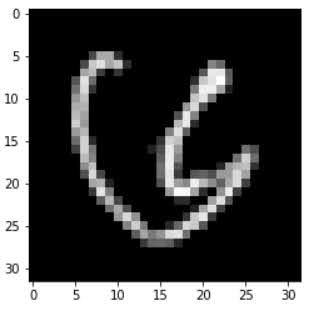
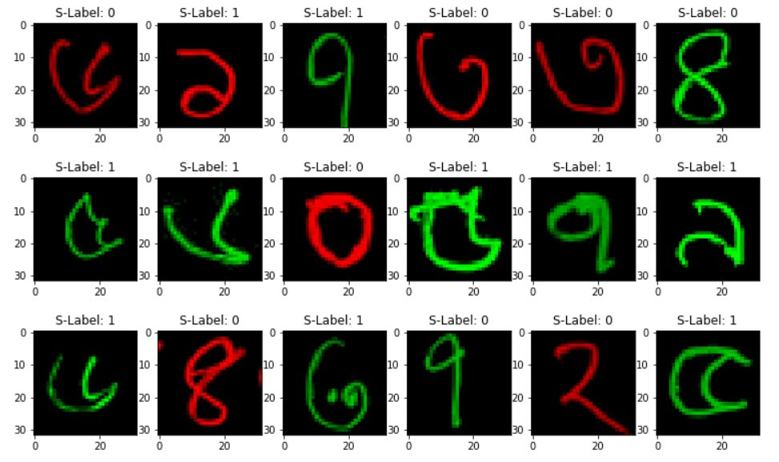

# Welcome to todays Meeting

Deep Dream Group

---

## Agenda

1. Text Classification Tasks!
2. Possible ICCIT!
3. Fair Data Generation Project!
4. Explainable Audio Classification!
---

## Text Classification Task

1. Finished part of Introduction
2. Finished abstract
3. Finished all the experiments
4. Need to write all the remaining parts

---

# Fair Bengali Handwritten Character Generation

Presented by: **Md Fahim Sikder**

Deep Dream Group

---

## Motivation

1. Data Fairness is needed!
2. Trustworthy AI!
3. Not much research has been done in Bengali!

---

## Research Problem

1. How can we create an Image dataset for Bengali domain?
2. How we can generate fair generative models?

---

## Data Fairness

1. Real world data is full of bias
   1. COMPAS case in the USA
<!--  -->

---

## Data Fairness

<!--  -->

---

## Bangla Sensitive Dataset

---

## Bangla Sensitive Dataset

---
## Generative Models

1. GAN-based
2. Diffusion-based

---

## Possible Contribution

1. Bangla Sensitive datasets
2. Generative model
3. Interpretability / Explainability

---

## Related Works

See zotero library.

---

## Explainable Audio Classification

---

## Idea

1. Train an audio classifier (preferably cnn/transformers based)
2. Explain the results
3. Compare different explainable techniques

---

## Possible Contribution

1. Unique model
2. Explainability

---

## Datasets

1. https://www.kaggle.com/datasets/ejlok1/toronto-emotional-speech-set-tess
2. https://github.com/Jakobovski/free-spoken-digit-dataset/tree/master

---

## Related Works

See zotero library.